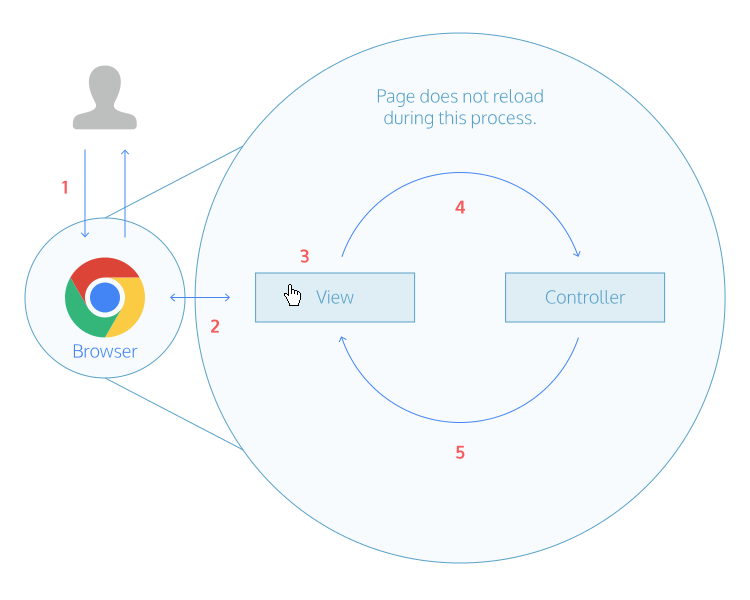

# AngulaJs - Beginner Tutorial

AngularJS is a JavaScript web framework aimed to make web apps simple to build and easy to maintain.

## Lesson 1 - Hello AngulaJs I
---

We'll start by building a simple AngularJS app. After making this app, we'll generalize a few steps that can be used to build more complex apps.
By the end of this course, you'll be able to use this sequence of steps to jumpstart your own AngularJS apps.

1. Let's get started by making a simple AngularJS app. We'll explain each step in the next exercise.
   In **app.js**, type in the contents exactly as you see here:


    ```
    var app = angular.module("myApp", []);
    ```

2. Open up **index.html**. Modify the `<body>` tag so it looks like this:


    ```
    <body ng-app="myApp">
    ```

3. Open up **js/controllers/MainController.js**. Type in the contents exactly as you see here:


    ```
    app.controller('MainController', ['$scope', function($scope) {
      $scope.title = 'Top Sellers in Books';
    }]);
    ```

4. Go to **index.html**. Modify the `<div class="main">` tag so it looks like this:


    ```
    <div class="main" ng-controller="MainController">
    ```

5. In **index.html** inside `<div class="main">`, modify the `<h1>` element so it looks like this:


    ```
    <h1>{{ title }}</h1>
    ```


## Lesson 2 - Hello AngulaJs II
---

* In **app.js**, we created a new module named `MyApp`. A module contains the different components of an AngularJS app.
* Then, in **index.html** we added `<body ng-app="myApp">`. The `ng-app` is called a directive. It tells AngularJS that the `MyApp` module will live within the `<body>` element,
termed the application's scope. In other words, we used the `ng-app` directive to define the application scope.
* In **MainController.js** we created a new controller named `MainController`. A controller manages the app's data. Here we use the property `title` to store a string, and attach it to `$scope`.
* Then, in **index.html**, we added `<div class="main" ng-controller="MainController">`. Like `ng-app`, `ng-controller` is a directive that defines the controller scope.
This means that properties attached to `$scope` in `MainController` become available to use within `<div class="main">`.
* Inside `<div class="main">` we accessed `$scope.title` using `{{ title }}`. This is called an *expression*. Expressions are used to display values on the page.
* The value of `title` showed up when we viewed the app in the browser.

1. Both the controller `MainController` and the view **index.html** have access to `$scope`. This means we can use `$scope` to communicate between the controller and the view.
In the controller, change the value of title to your own string.

2. Likewise, any new properties attached to `$scope` will become available to use in the view. In the controller, attach *promo* to `$scope`, and set its value to your own string.

3. In the view under the `<h1>` element, add an `<h2>` element and use an expression to display *promo* on the page.


## Lesson 3 - Workflow
---

##### Summary
So far this is our typical workflow when making an AngularJS app:

* Create a module, and use `ng-app` in the view to define the application scope.
* Create a controller, and use `ng-controller` in the view to define the controller scope.
* Add data to `$scope` in the controller so they can be displayed with expressions in the view.


1. Let's add more data to the controller and display them in the view. In the controller, attach another property to `$scope` named `product`. Set it equal to an object with the following properties:


    ```
    $scope.product = {name: 'The Book of Trees', price: 19}
    ```

2. Then, in **index.html** inside `<p class="title">`, access the product's name with `product.name` and display it using an expression.
3. In `<p class="price">`, access and display the product's price.

## Lesson 4 - Filters I
---

In the controller, you used an object to group together related data about a product. Then in the view, you used dot notation to display the values.

1. Currently the product price shows up as a number. It would be better to format it as a currency. Rather than change the data in the controller, let's use an AngularJS filter to format the data in the view.
   In **index.html** in `<p class="price">`, change the expression to look like this:


    ```
    {{ product.price | currency }}
    ```


## Lesson 5 - Filters II
---

Great! The product price changed from a number to a formatted currency. How does it work?

* AngularJS gets the value of `product.price`.
* It sends this number into the `currency` filter. The pipe symbol (|) takes the output on the left and "pipes" it to the right.
* The filter outputs a formatted currency with the dollar sign and the correct decimal places.
* In this way, filters help to separate the content in the controller from its presentation in the view.

1. AngularJS comes with a few more `built-in filters`. Let's use two more.
   In **MainController.js** inside `$scope.product`, add a third property named `pubdate`:


   ```
   pubdate: new Date('2014', '03', '08')
   ```

2. In **index.html** inside `<p class="date">`, display the product's pubdate.
3. Format the product's pubdate by piping it to the `date` filter.
4. Format the product's name by piping it to the `uppercase` filter.

## Lesson 6 - ng-repeat I
---

Let's do a quick review:

* A module contains the different components of an AngularJS app
* A controller manages the app's data
* An expression displays values on the page
* A filter formats the value of an expression

1. Let's add more data to the controller and display them in the view.
   In the controller, delete the `$scope.product` object.
2. Attach a new property to `$scope` named `products`. Set it equal to an array of objects. Type in the contents exactly as you see here:


    ```
    [
      {
        name: 'The Book of Trees',
        price: 19,
        pubdate: new Date('2014', '03', '08'),
        cover: 'img/the-book-of-trees.jpg'
      },
      {
        name: 'Program or be Programmed',
        price: 8,
        pubdate: new Date('2013', '08', '01'),
        cover: 'img/program-or-be-programmed.jpg'
      }
    ]
    ```

3. In the view inside `<div class="main">`, delete the `<div class="col-md-6">` element.
   Replace it with this HTML. Type in the contents exactly as you see here:


    ```
    <div ng-repeat="product in products" class="col-md-6">
     <div class="thumbnail">
       
       <p class="title">{{ product.name }}</p>
       <p class="price">{{ product.price | currency }}</p>
       <p class="date">{{ product.pubdate | date }}</p>
     </div>
    </div>
    ```


## Lesson 7 - ng-repeat II
---

Well done! You got both books in `$scope.products` to show up in the view. How does it work?

* In the controller, we used `products` to store an array containing two objects.
* Then in the view, we added `<div ng-repeat="product in products">`. Like `ng-app` and `ng-controller`, the `ng-repeat` is a *directive*.
It loops through an array and displays each element. Here, the `ng-repeat` repeats all the HTML inside `<div class="col-md-6">` for each element in the products array.

In this way, `ng-repeat` shows both products in the `$scope.products` array. Instead of writing the same HTML twice as before, we just use `ng-repeat` to generate the HTML twice.

1. The problem now is that both products have the same image. Let's fix this.
   In the view inside `<div class="col-md-6">`, replace


    ```
    
    ```

with


    ```
    
    ```

The `ng-src` is a directive that sets the `` element's src to a property in the controller.


## Lesson 8 - Directives
---

We've used a few directives so far - `ng-app`, `ng-controller`, `ng-repeat`, and `ng-src`. What can we generalize about directives?

Directives bind behavior to HTML elements. When the app runs, AngularJS walks through each HTML element looking for directives.
When it finds one, AngularJS triggers that behavior (like attaching a scope or looping through an array).

1. In the controller, add two of your favorite books to the `$scope.products` array.
   The view will update as the `ng-repeat` loops the new elements in the `$scope.products` array.


## Lesson 9 - ng-click I
---

So far we've made a static AngularJS app by adding properties in the controller and displaying them in the view.
AngularJS is a framework for building dynamic web apps, so let's start to make this app interactive.

1. In the controller in the `$scope.products` array, add a new property named `likes` to each element. Set all likes properties to 0.
2. In the view under `<p class="date">`, type in a rating element:


    ```
    <div class="rating">
        <p class="likes">+ </p>
    </div>
    ```

Inside `<p class="likes">`, display a product's likes using an expression.

3. Back in the controller after `$scope.products`, attach a new property to $scope named plusOne. Set it equal to function. Type in the contents exactly as you see here:


    ```
    function(index) {
        $scope.products[index].likes += 1;
    };
    ```

4. In the view modify `<p class="likes">` to look like this:


    ```
    <p class="likes" ng-click="plusOne($index)">
    ```

View the AngularJS app in the browser. Click on the +0 in each product tile.


## Lesson 10 - ng-click II
---

Great! Each time you click on the number of likes, the number goes up. How does it work?

* The `ng-click` is a directive. When `<p class="likes">` is clicked, `ng-click` tells AngularJS to run the `plusOne()` function in the controller.
* The `plusOne()` function gets the `index` of the product that was clicked, and then adds one to that product's likes property.

Notice that the `plusOne()` doesn't interact with the view at all; it just updates the controller. Any change made to the controller shows up in the view.

1. In the controller in the `$scope.products` array, add a new property named `dislikes` to each element. Set dislikes to 0.
2. In the view under `<p class="likes">`, add an element for `<p class="dislikes">`. Then display a product's dislikes using an expression.
3. Back in the controller after `$scope.products`, attach a new property to `$scope` named `minusOne`.
   Set it equal to a function that adds one to a product's `dislikes` property. Adapt the code from the `plusOne()` function to do this.
4. In the view, use `ng-click` to trigger the `minusOne()` function when `<p class="dislikes">` is clicked.
   View the AngularJS app in the browser. Click on the -0 in each product tile.

## Lesson 11 - Generalizations
---

Congratulations! You built an AngularJS app from scratch. What can we generalize so far?

* A user visits the AngularJS app.
* The view presents the app's data through the use of expressions, filters, and directives. Directives bind new behavior HTML elements.
* A user clicks an element in the view. If the element has a directive, AngularJS runs the function.
* The function in the controller updates the state of the data.
* The view automatically changes and displays the updated data. The page doesn't need to reload at any point.



Practice what you learned in this section with three real-world projects:

* [Bolt Network](http://www.codecademy.com/en/practice/learn-angularjs/topics/your-first-app/projects/angularjs_bolt-network-1)
* [Pizza Planet](http://www.codecademy.com/en/practice/learn-angularjs/topics/your-first-app/projects/angularjs_pizza-planet)
* [MOVE Log](http://www.codecademy.com/en/practice/learn-angularjs/topics/your-first-app/projects/angularjs_move-log)


