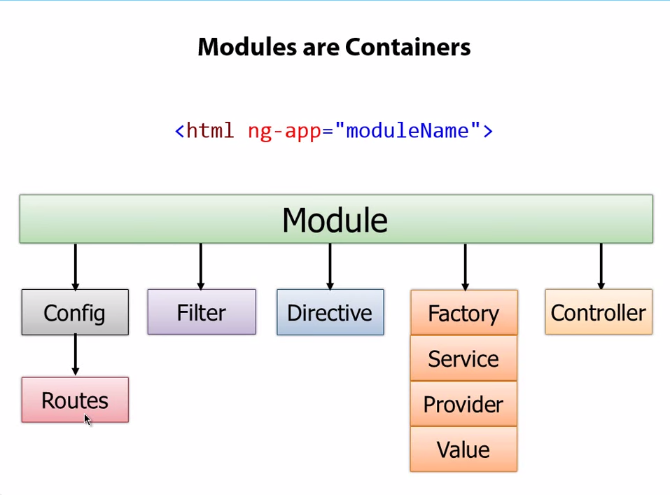

### ng-app

* built-in angular directive
* when found, angular.js script (loaded into a view) will initialize an `angular application`
* create a module/ng-app by:

    var demo = angular.module('demoApp', []);               // what is the array [] for???
    var demo = angular.module('demoApp', ['otherDemoApp']); // module that demoApp depends on (by dependency injection)

### ng-model

    ng-model="pname"

* add a property (pname)into the $scope
* that property can be used as data binding expression `{{ pname }}` in view

### ng-init

    ng-init="names=['John', 'Anne']"

* allows you to evaluate an expression in the current scope.

### ng-repeat

    ng-repeat="cust in customers | filter:name | orderBy:'city'"

* instantiates a template once per item from a collection.
Each template instance gets its own scope, where the given loop variable is set to the current collection item,
and $index is set to the item index or key.

